- [Evaluation Checklist](#evaluation-checklist)
- [Data Source: Common Crawl](#data-source-common-crawl)
  - [What is Common Crawl?](#what-is-common-crawl)
  - [Why Common Crawl Exists](#why-common-crawl-exists)
  - [Types of Common Crawl Files](#types-of-common-crawl-files)
- [Project: Large Web-Scale Deduplication and Cleaning](#project-large-web-scale-deduplication-and-cleaning)
  - [Problem Statement](#problem-statement)
  - [What This Project Produces](#what-this-project-produces)
  - [Requirements](#requirements)
    - [Functional Requirements](#functional-requirements)
- [High-Level Design](#high-level-design)
  - [Why WET Files](#why-wet-files)
- [End-to-End Flow](#end-to-end-flow)
- [Repository Structure](#repository-structure)
- [Setup Guide](#setup-guide)
  - [What You Need Before Starting](#what-you-need-before-starting)
  - [Step 1: Create the GCP Project, Service Account, and Bucket](#step-1-create-the-gcp-project-service-account-and-bucket)
    - [1.1 Create a GCP project](#11-create-a-gcp-project)
    - [1.2 Create a service account](#12-create-a-service-account)
    - [1.3 Grant the service account the right permissions](#13-grant-the-service-account-the-right-permissions)
    - [1.4 Generate and download the JSON key](#14-generate-and-download-the-json-key)
    - [1.5 Put the JSON key in `terraform/keys/`](#15-put-the-json-key-in-terraformkeys)
    - [1.6 Review Terraform variables](#16-review-terraform-variables)
    - [1.7 Run Terraform](#17-run-terraform)
    - [1.8 Verify the bucket](#18-verify-the-bucket)
  - [Step 2: Start Airflow with Docker Compose](#step-2-start-airflow-with-docker-compose)
  - [Step 3: Open Airflow and Log In](#step-3-open-airflow-and-log-in)
  - [Step 4: Trigger the Pipeline DAG](#step-4-trigger-the-pipeline-dag)
    - [Airflow DAG Overview](#airflow-dag-overview)
    - [Airflow Ingest](#airflow-ingest)
  - [Step 5: Check that data is uploaded to Data Lake (GCS)](#step-5-check-that-data-is-uploaded-to-data-lake-gcs)
  - [Step 6: View Data in BigQuery](#step-6-view-data-in-bigquery)
  - [What Success Looks Like](#what-success-looks-like)
    - [GCS Bucket](#gcs-bucket)
    - [GCS BigQuery](#gcs-bigquery)
  - [Common Setup Issues](#common-setup-issues)
  - [Step 7: View the Dashboard Locally](#step-7-view-the-dashboard-locally)
    - [7.1 Install Dashboard Dependencies](#71-install-dashboard-dependencies)
    - [7.2 Run the Dashboard](#72-run-the-dashboard)
      - [Dashboard: Top Domains by Document Count](#dashboard-top-domains-by-document-count)
      - [Dashboard: Document Distribution Over Time](#dashboard-document-distribution-over-time)
    - [7.3 Configure the Dashboard](#73-configure-the-dashboard)
  - [Recommended Run Order](#recommended-run-order)
  - [References](#references)

# Evaluation Checklist

| Criterion | Status | Score | What I Built | Evidence |
| --- | --- | --- | --- | --- |
| Problem description | ✅ | 4 points | I clearly explain the Common Crawl data quality problem: duplicate pages, mirrored content, boilerplate, and low-value text, and I state that the project solves this with a deduplication and cleaning pipeline. | [README.md](./README.md) in `Problem Statement` and `What This Project Produces` |
| Cloud | ✅ | 4 points | I used Google Cloud for storage and warehousing, and I provision the cloud resources with Infrastructure as Code using Terraform. | [terraform/main.tf](./terraform/main.tf), [terraform/providers.tf](./terraform/providers.tf), [terraform/variables.tf](./terraform/variables.tf), [docs/setup.md](./docs/setup.md) Step 1 |
| Data Ingestion (Batch) | ✅ | 4 points | I built an end-to-end Airflow batch pipeline that ingests Common Crawl WET files into GCS, transforms them, and then loads the final dataset into BigQuery. | [dags/common_crawl_gcs_to_bigquery_dag.py](./dags/common_crawl_gcs_to_bigquery_dag.py), [scripts/ingest_to_gcs_threaded.py](./scripts/ingest_to_gcs_threaded.py), [scripts/load_gcs_parquet_to_bigquery.py](./scripts/load_gcs_parquet_to_bigquery.py), [docs/setup.md](./docs/setup.md) Steps 2 to 6 |
| Data warehouse | ✅ | 4 points | I load the final dataset into BigQuery and configured the warehouse table with partitioning on `crawl_date` and clustering on `domain` and `crawl_id` in BigQuery itself. | [scripts/load_gcs_parquet_to_bigquery.py](./scripts/load_gcs_parquet_to_bigquery.py), [docs/setup.md](./docs/setup.md) Step 6, [docs/diagrams/gcp-bigquery-shot.png](./docs/diagrams/gcp-bigquery-shot.png), [docs/diagrams/bigquery-partition-and-cluster.png](./docs/diagrams/bigquery-partition-and-cluster.png), [docs/diagrams/bigquery-partition-cluster-query.png](./docs/diagrams/bigquery-partition-cluster-query.png) |
| Transformations (Spark) | ✅ | 4 points | I implemented the transformation layer in Spark, including text normalization, exact deduplication, and MinHash-based near-duplicate filtering. | [batch/pyspark_batch_gcs.py](./batch/pyspark_batch_gcs.py), [batch/pyspark_batch_gcs.ipynb](./batch/pyspark_batch_gcs.ipynb) |
| Dashboard | ✅ | 4 points | I built a local Streamlit dashboard with two tiles: a categorical chart for top domains and a temporal chart for document distribution over time. | [dashboard/app.py](./dashboard/app.py), [dashboard/README.md](./dashboard/README.md), [docs/diagrams/streamlit-top-domains.png](./docs/diagrams/streamlit-top-domains.png), [docs/diagrams/streamlit-document-distribution.png](./docs/diagrams/streamlit-document-distribution.png) |
| Reproducibility | ✅ | 4 points | I documented the full setup flow from GCP credentials and Terraform to Airflow, BigQuery, and the local Streamlit dashboard. | [docs/setup.md](./docs/setup.md), [README.md](./README.md) `Setup Guide` |

# Data Source: Common Crawl

About: https://commoncrawl.org/  
Getting Started: https://commoncrawl.org/get-started

## What is Common Crawl?

- Common Crawl is a large public dataset of web crawl data.
- You can think of it as a free, internet-scale snapshot of the public web.
- It is maintained by a non-profit organization and gives researchers, engineers, and companies access to web data without having to crawl the internet themselves.
- It is not the whole internet. It is a sampled and curated slice of the web.

## Why Common Crawl Exists

- Crawling the public web at scale is expensive and operationally difficult.
- Common Crawl solves that by collecting the data once and publishing it for others to use.
- That makes it much easier to build search, analytics, and machine learning workflows on top of web-scale text.

## Types of Common Crawl Files

- `WARC`: raw web responses, including HTML
- `WAT`: metadata such as headers and links
- `WET`: extracted plain text with HTML removed

# Project: Large Web-Scale Deduplication and Cleaning

## Problem Statement

Common Crawl is valuable, but it is also noisy.

A large crawl of the web contains:

- duplicate pages copied across domains
- mirrored or near-identical pages
- navigation menus, headers, footers, cookie banners, and other boilerplate
- low-value or spam-like content

That becomes a real data engineering problem because raw Common Crawl text is not automatically clean enough for analytics or downstream ML use.

Without cleaning and deduplication:

- storage is wasted on repeated content
- document counts become misleading
- downstream analytics are less trustworthy
- machine learning datasets become lower quality

This project addresses that problem by building a pipeline that ingests sampled Common Crawl WET files, transforms them into cleaner parquet outputs, and loads the final result into BigQuery for analysis.

## What This Project Produces

The pipeline is designed to help answer questions like:

- Which pages contain real, unique content?
- Which pages are near-duplicates of each other?
- Which pages are mostly boilerplate or low-value text?

## Requirements

### Functional Requirements

The project should be able to:

- ingest sampled Common Crawl WET files into Google Cloud Storage
- process the text into cleaner parquet outputs
- support deduplication-oriented analysis on the resulting dataset
- load the final outputs into BigQuery for querying and downstream work

# High-Level Design

## Why WET Files

- This project focuses on text cleaning and near-duplicate detection, so `WET` files are the best fit.
- `WET` files already contain extracted text, which removes a lot of the overhead of parsing raw HTML first.
- `WARC` files would include raw page content and require extra HTML extraction work.
- `WAT` files contain metadata, but not the actual text body we want to clean and compare.

# End-to-End Flow

This diagram shows the project from start to finish, from cloud setup through orchestration, storage, transformation, warehousing, and dashboarding.

<p align="center">
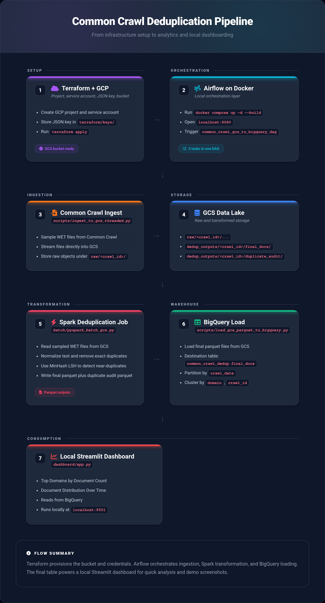
</p>

# Repository Structure

```text
.
├── batch/
├── dags/
├── dashboard/
├── docs/
├── scripts/
├── terraform/
├── Dockerfile
└── docker-compose.yaml
```

- `batch/` contains the Spark-based transformation logic.
- `dags/` contains the Airflow DAGs that orchestrate the pipeline.
- `dashboard/` contains the Streamlit dashboard for visualizing pipeline results.
- `docs/` contains setup notes, diagrams, and runbook-style documentation.
- `scripts/` contains ingestion and BigQuery loading scripts.
- `terraform/` contains infrastructure code for provisioning Google Cloud resources.

# Setup Guide

For the full setup instructions, go to [docs/setup.md](./docs/setup.md) or see below.

That guide covers:

- creating the GCP project and service account
- placing the JSON key in `terraform/keys/`
- running `terraform apply`
- starting Airflow with Docker Compose
- logging into `http://localhost:8080`
- triggering `common_crawl_gcs_to_bigquery_dag`
- viewing results in the local Streamlit dashboard at `http://localhost:8501`

This guide is the full, step-by-step setup for running the Common Crawl deduplication pipeline locally.

The goal is simple:

1. Create the Google Cloud resources the pipeline needs.
2. Start Airflow locally with Docker Compose.
3. Trigger the DAG that ingests Common Crawl data into GCS, transforms the WET files into parquet, and loads the final dataset into BigQuery.

If you follow the steps below in order, you should be able to run the project end to end without jumping between multiple docs.

## What You Need Before Starting

Make sure you have:

- Terraform installed
- Docker Desktop or Docker Engine with Docker Compose installed
- A Google Cloud project with billing enabled
- This repository cloned locally

## Step 1: Create the GCP Project, Service Account, and Bucket

This project uses Terraform to provision the Google Cloud Storage bucket that acts as the raw data lake for the pipeline.

Before Terraform can run, you need a GCP project and a service account JSON key.

### 1.1 Create a GCP project

Create or choose a Google Cloud project where you want the pipeline resources to live.

The default project ID used in this repository is:

```text
common-crawl-deduplication
```

If you use a different project ID, that is completely fine. Just make sure you update the Terraform variables before running `terraform apply`.

### 1.2 Create a service account

In Google Cloud Console:

- Go to `IAM & Admin`
- Open `Service Accounts`
- Click `Create Service Account`


Use any service account name you prefer, but keep it easy to recognize because this account will be used by:

- Terraform
- the ingestion scripts
- the Airflow DAG


### 1.3 Grant the service account the right permissions

Give the service account these IAM roles:

- `Storage Admin`
- `BigQuery Admin`

Those roles are needed because the pipeline has to:

- create and use a GCS bucket
- upload Common Crawl WET files into cloud storage
- create datasets and tables in BigQuery
- load final parquet outputs into BigQuery


### 1.4 Generate and download the JSON key

After the service account is created:

- open that service account
- go to `Keys`
- click `Add Key`
- choose `Create New Key`
- select `JSON`

You can follow the same flow shown below:


After the key is created, you should see it listed as active:


### 1.5 Put the JSON key in `terraform/keys/`

Move the downloaded JSON key file into:

```text
terraform/keys/
```

Important: the current DAG code expects this exact filename:

```text
terraform/keys/common-crawl-deduplication-XXXXXXXXXXXX.json
```

So the easiest path is to name your key file exactly:

```text
common-crawl-deduplication-XXXXXXXXXXXX.json
```

If you want to use a different filename, you will also need to update:

- [common_crawl_gcs_to_bigquery_dag.py](./dags/common_crawl_gcs_to_bigquery_dag.py)
- [variables.tf](./terraform/variables.tf)

### 1.6 Review Terraform variables

Open [variables.tf](./terraform/variables.tf) and confirm the values make sense for your project:

- `project_id`
- `region`
- `credentials_file`

The defaults in this repository are:

```hcl
project_id       = "common-crawl-deduplication"
region           = "us-east1"
credentials_file = "keys/common-crawl-deduplication-XXXXXXXXXXXX.json"
```

This project uses `us-east1` because Common Crawl data is hosted in AWS `us-east-1`, so it is a sensible region for keeping the pipeline geographically close to the source data.

### 1.7 Run Terraform

From the repository root:

```bash
cd terraform
terraform init
terraform plan
terraform apply
```

When `terraform apply` succeeds, Terraform should create the storage resources for the pipeline.

### 1.8 Verify the bucket

After Terraform finishes, check Google Cloud Storage and confirm the bucket exists.

The default bucket name used by the project is:

```text
ccdp-raw-common-crawl-deduplication
```

That bucket will store:

- raw Common Crawl WET files
- transformed parquet outputs
- final files that will later be loaded into BigQuery

Example bucket view:


## Step 2: Start Airflow with Docker Compose

Once the bucket and credentials are ready, the next step is to build and start the local Airflow environment.

From the root of the repository, run:

```bash
docker compose up -d --build
```

If your machine still uses the older command format, this is the equivalent:

```bash
docker-compose up -d --build
```

This command will:

- build the custom Airflow image from the repo `Dockerfile`
- start Airflow, PostgreSQL, and Redis
- mount your local project folders into the running containers

The first build can take a few minutes, so do not worry if it is slow the first time.

## Step 3: Open Airflow and Log In

After Docker finishes starting the services, open this in your browser:

```text
http://localhost:8080
```

Log in with:

- username: `airflow`
- password: `airflow`

If the page does not open right away, wait a minute and try again. Airflow can take a little time to finish starting on the first run.

## Step 4: Trigger the Pipeline DAG

In the Airflow UI, look for this DAG:

```text
common_crawl_gcs_to_bigquery_dag
```

When `common_crawl_gcs_to_bigquery_dag` runs, it executes three tasks in order:

1. `ingest_to_gcs`
2. `transform_gcs_wets`
3. `load_final_docs_to_bigquery`

This is the main DAG for the project.

Use the Airflow UI to trigger it manually.

These screenshots show the DAG view and the trigger flow:

### Airflow DAG Overview

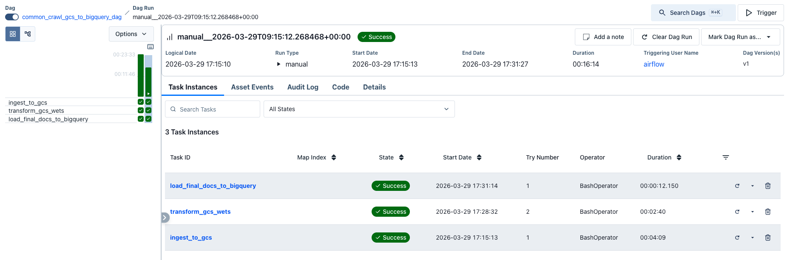

### Airflow Ingest

- `ingest_to_gcs` DAG downloads a sampled set of Common Crawl WET files and uploads them into your GCS data lake.

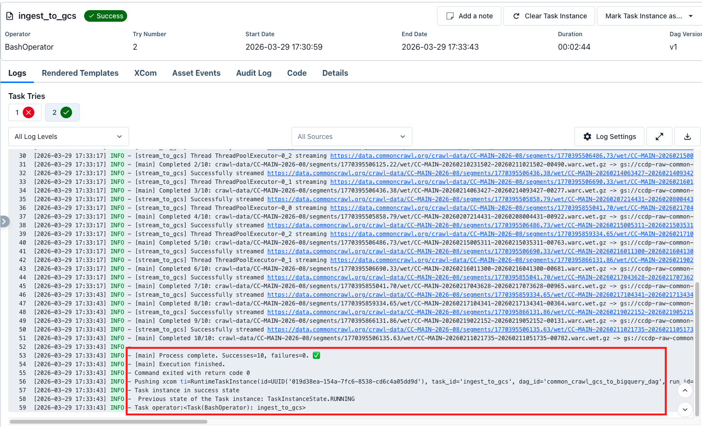

- `transform_gcs_wets` DAG transforms those WET files into parquet outputs.

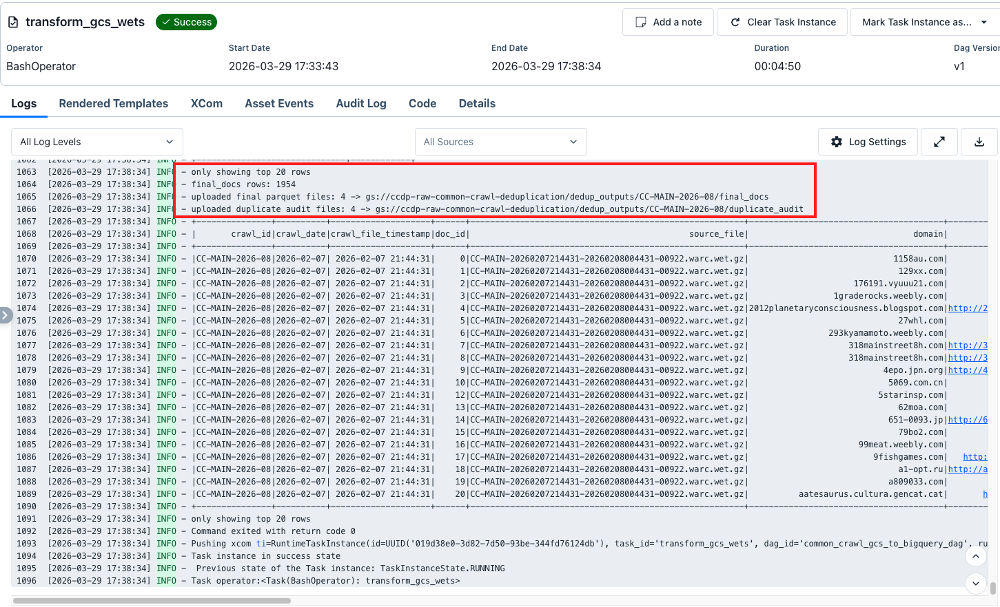

- `load_final_docs_to_bigquery` loads the final parquet data into BigQuery.

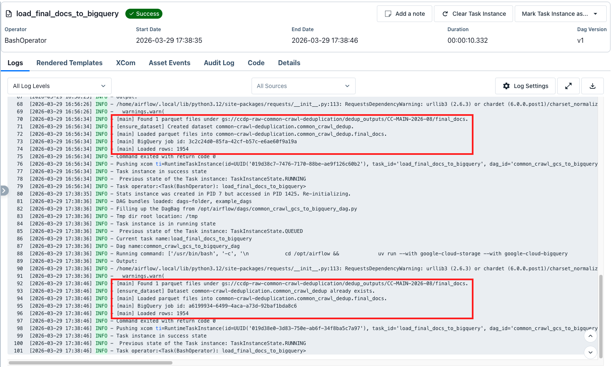

## Step 5: Check that data is uploaded to Data Lake (GCS)

- Verify data was ingested into Google Cloud Storage (Data Lake)


- Verify that after transforming raw data with PySpark, data was uploaded as parquet files onto GCS

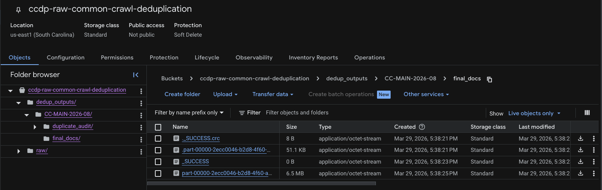

## Step 6: View Data in BigQuery

- Visualize data on BigQuery

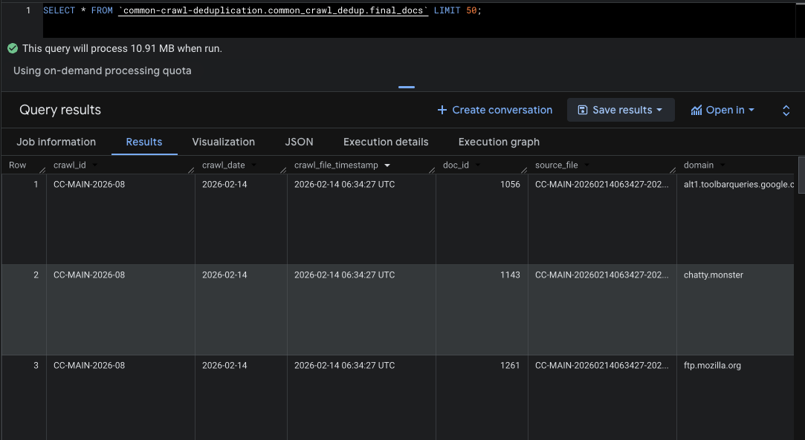

- Applying Partition (`crawl_date`) and Cluster (`domain`, `crawl_id`).

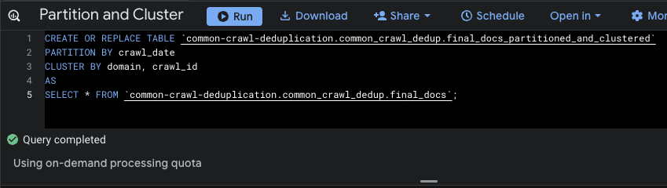

- Querying by partition and cluster

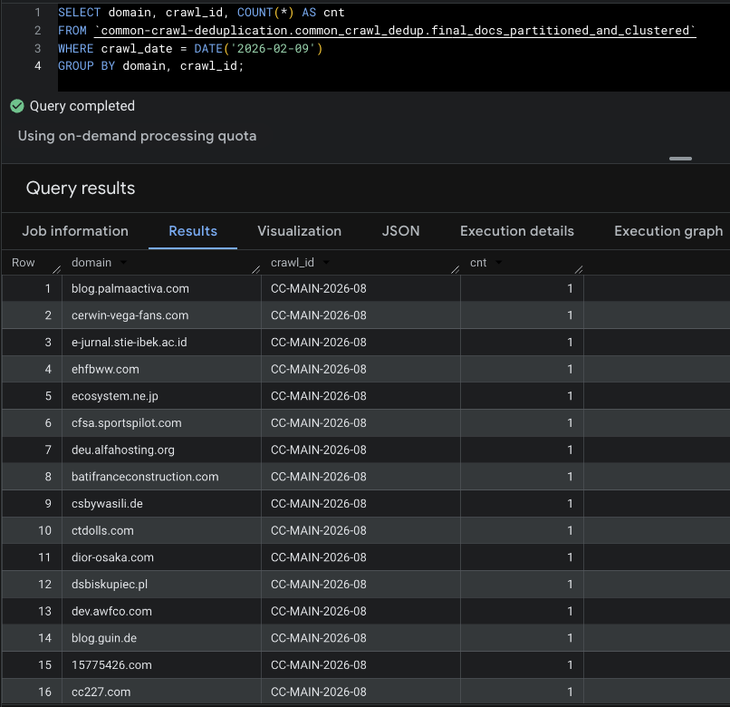

## What Success Looks Like

If everything works, you should end up with data in these locations:

- GCS raw files: `gs://ccdp-raw-common-crawl-deduplication/raw/<crawl_id>/...`
- GCS final parquet: `gs://ccdp-raw-common-crawl-deduplication/dedup_outputs/<crawl_id>/final_docs/...`
- GCS duplicate audit parquet: `gs://ccdp-raw-common-crawl-deduplication/dedup_outputs/<crawl_id>/duplicate_audit/...`
- BigQuery final table: `common-crawl-deduplication.common_crawl_dedup.final_docs`

You may also see sampled objects appear in the bucket like this:

### GCS Bucket

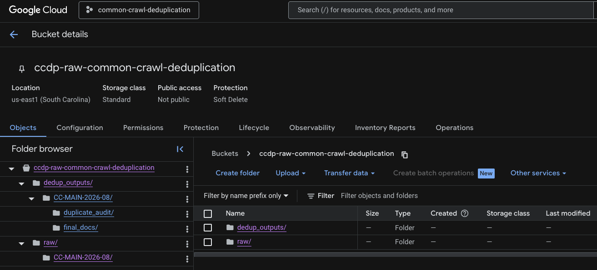

### GCS BigQuery

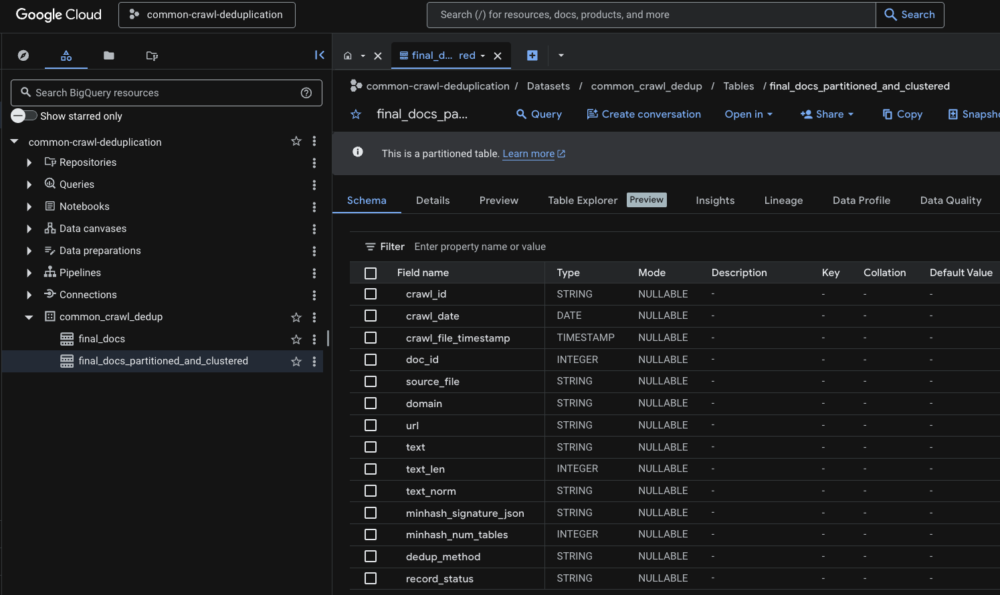

## Common Setup Issues

If the DAG is visible in Airflow but fails quickly, the most common reasons are:

- the service account JSON key is missing from `terraform/keys/`
- the JSON key filename does not match what the DAG expects
- the service account is missing `Storage Admin` or `BigQuery Admin`
- the GCS bucket was not created successfully by Terraform

If Airflow itself does not open at `http://localhost:8080`, it usually means the containers are still starting or the Docker build has not finished yet.

## Step 7: View the Dashboard Locally

After the pipeline completes and data is loaded into BigQuery, you can visualize the results using the local Streamlit dashboard.

The dashboard provides two main visualizations:

1. **Top Domains by Document Count** - Shows the categorical distribution of deduplicated documents across the most common domains
2. **Documents Over Time** - Shows the temporal distribution of documents by crawl date

### 7.1 Install Dashboard Dependencies

From the repository root, navigate to the dashboard directory and install the required packages:

```bash
cd dashboard
source .venv/bin/activate
pip install -r requirements.txt
```

### 7.2 Run the Dashboard

Start the Streamlit dashboard:

```bash
streamlit run app.py
```

The dashboard will automatically open in your browser at `http://localhost:8501`.

This dashboard runs locally on your machine. For this project, that is enough to satisfy the dashboard requirement during a live demo or walkthrough.

The dashboard displays:

- **Summary Statistics**: Total documents, unique domains, crawl dates, and average text length
- **Top Domains Bar Chart**: Visual distribution of documents across the most common domains
- **Temporal Line Chart**: Document counts over time by crawl date
- **Data Tables**: Expandable views of the underlying data for each visualization

For more details, see [dashboard/README.md](./dashboard/README.md).

#### Dashboard: Top Domains by Document Count

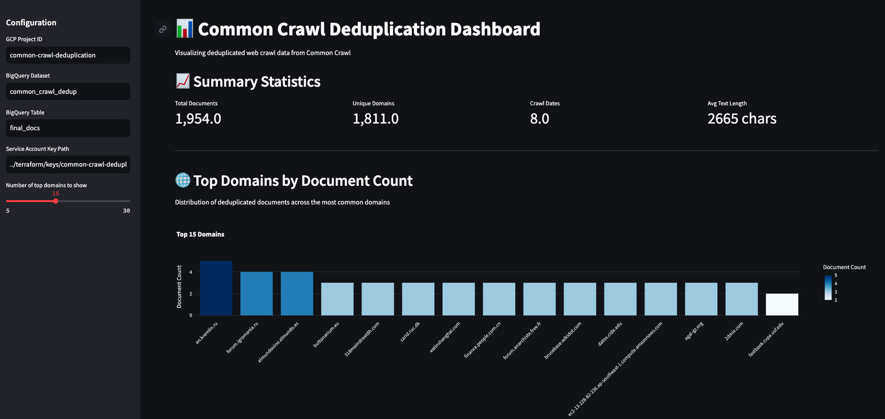
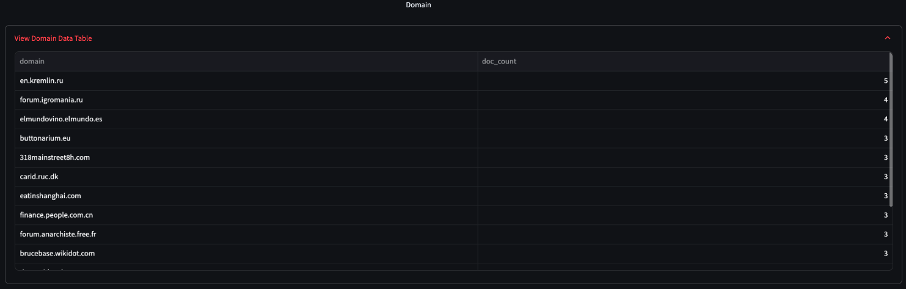

#### Dashboard: Document Distribution Over Time

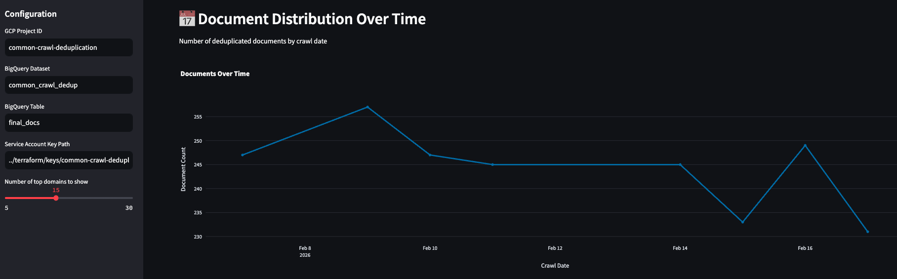

### 7.3 Configure the Dashboard

The dashboard uses the same service account key as the pipeline. By default, it looks for:

```text
./terraform/keys/common-crawl-deduplication-XXXXXXXXXXXX.json
```

You can adjust the configuration in the sidebar if needed:

- GCP Project ID
- BigQuery Dataset (default: `common_crawl_dedup`)
- BigQuery Table (default: `final_docs`)
- Service Account Key Path
- Number of top domains to display

## Recommended Run Order

If you just want the cleanest path, use this order:

1. Create the GCP project.
2. Create the service account.
3. Grant `Storage Admin` and `BigQuery Admin`.
4. Download the JSON key.
5. Move the JSON key into `terraform/keys/`.
6. Confirm `terraform/variables.tf`.
7. Run `terraform apply`.
8. Run `docker compose up -d --build`.
9. Open `http://localhost:8080`.
10. Log in with `airflow` / `airflow`.
11. Trigger `common_crawl_gcs_to_bigquery_dag`.
12. Once the DAG completes, run the dashboard with `streamlit run app.py` from the `dashboard/` directory.

That is the full local setup for this project.

## References

- https://arxiv.org/pdf/2111.10864
- https://huggingface.co/spaces/HuggingFaceFW/blogpost-fineweb-v1
