# Project Setup Guide

This guide is the full, step-by-step setup for running the Common Crawl deduplication pipeline locally.

The goal is simple:

1. Create the Google Cloud resources the pipeline needs.
2. Start Airflow locally with Docker Compose.
3. Trigger the DAG that ingests Common Crawl data into GCS, transforms the WET files into parquet, and loads the final dataset into BigQuery.

If you follow the steps below in order, you should be able to run the project end to end without jumping between multiple docs.

## What You Need Before Starting

Make sure you have:

- Terraform installed
- Docker Desktop or Docker Engine with Docker Compose installed
- A Google Cloud project with billing enabled
- This repository cloned locally

## Step 1: Create the GCP Project, Service Account, and Bucket

This project uses Terraform to provision the Google Cloud Storage bucket that acts as the raw data lake for the pipeline.

Before Terraform can run, you need a GCP project and a service account JSON key.

### 1.1 Create a GCP project

Create or choose a Google Cloud project where you want the pipeline resources to live.

The default project ID used in this repository is:

```text
common-crawl-deduplication
```

If you use a different project ID, that is completely fine. Just make sure you update the Terraform variables before running `terraform apply`.

### 1.2 Create a service account

In Google Cloud Console:

- Go to `IAM & Admin`
- Open `Service Accounts`
- Click `Create Service Account`

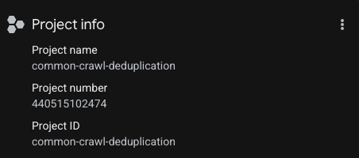

Use any service account name you prefer, but keep it easy to recognize because this account will be used by:

- Terraform
- the ingestion scripts
- the Airflow DAG

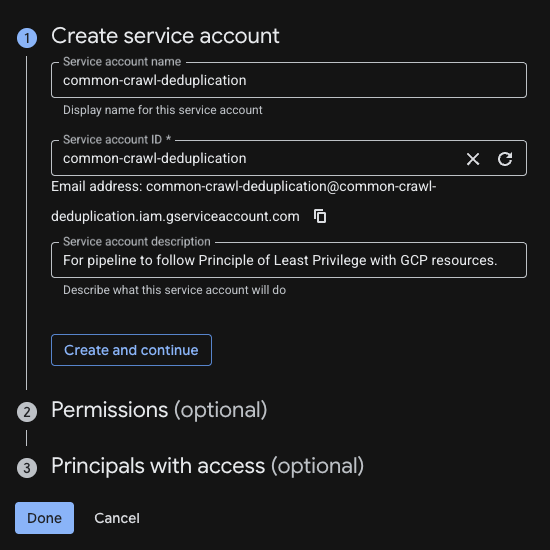

### 1.3 Grant the service account the right permissions

Give the service account these IAM roles:

- `Storage Admin`
- `BigQuery Admin`

Those roles are needed because the pipeline has to:

- create and use a GCS bucket
- upload Common Crawl WET files into cloud storage
- create datasets and tables in BigQuery
- load final parquet outputs into BigQuery

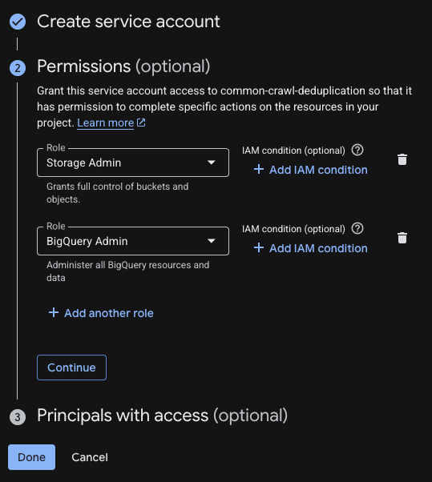

### 1.4 Generate and download the JSON key

After the service account is created:

- open that service account
- go to `Keys`
- click `Add Key`
- choose `Create New Key`
- select `JSON`

You can follow the same flow shown below:

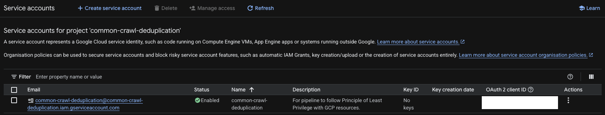

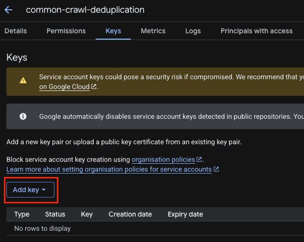

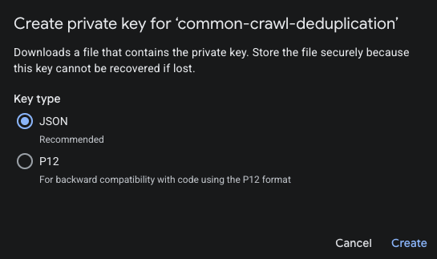

After the key is created, you should see it listed as active:

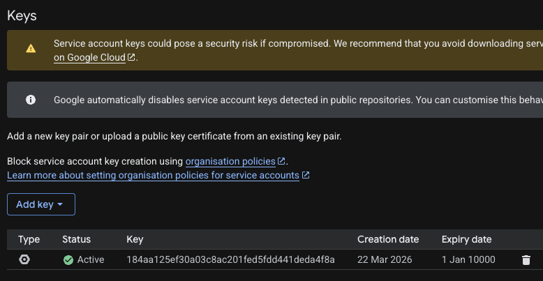

### 1.5 Put the JSON key in `terraform/keys/`

Move the downloaded JSON key file into:

```text
terraform/keys/
```

Important: the current DAG code expects this exact filename:

```text
terraform/keys/common-crawl-deduplication-184aa125ef30.json
```

So the easiest path is to name your key file exactly:

```text
common-crawl-deduplication-184aa125ef30.json
```

If you want to use a different filename, you will also need to update:

- [common_crawl_gcs_to_bigquery_dag.py](../dags/common_crawl_gcs_to_bigquery_dag.py)
- [variables.tf](../terraform/variables.tf)

### 1.6 Review Terraform variables

Open [variables.tf](../terraform/variables.tf) and confirm the values make sense for your project:

- `project_id`
- `region`
- `credentials_file`

The defaults in this repository are:

```hcl
project_id       = "common-crawl-deduplication"
region           = "us-east1"
credentials_file = "keys/common-crawl-deduplication-184aa125ef30.json"
```

This project uses `us-east1` because Common Crawl data is hosted in AWS `us-east-1`, so it is a sensible region for keeping the pipeline geographically close to the source data.

### 1.7 Run Terraform

From the repository root:

```bash
cd terraform
terraform init
terraform plan
terraform apply
```

When `terraform apply` succeeds, Terraform should create the storage resources for the pipeline.

### 1.8 Verify the bucket

After Terraform finishes, check Google Cloud Storage and confirm the bucket exists.

The default bucket name used by the project is:

```text
ccdp-raw-common-crawl-deduplication
```

That bucket will store:

- raw Common Crawl WET files
- transformed parquet outputs
- final files that will later be loaded into BigQuery

Example bucket view:

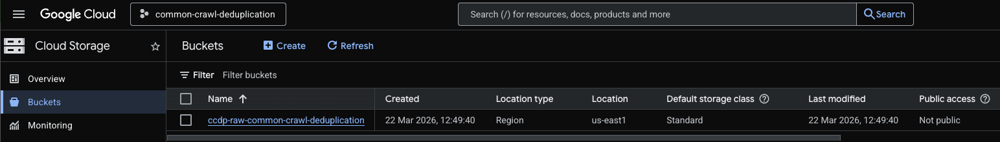

## Step 2: Start Airflow with Docker Compose

Once the bucket and credentials are ready, the next step is to build and start the local Airflow environment.

From the root of the repository, run:

```bash
docker compose up -d --build
```

If your machine still uses the older command format, this is the equivalent:

```bash
docker-compose up -d --build
```

This command will:

- build the custom Airflow image from the repo `Dockerfile`
- start Airflow, PostgreSQL, and Redis
- mount your local project folders into the running containers

The first build can take a few minutes, so do not worry if it is slow the first time.

## Step 3: Open Airflow and Log In

After Docker finishes starting the services, open this in your browser:

```text
http://localhost:8080
```

Log in with:

- username: `airflow`
- password: `airflow`

If the page does not open right away, wait a minute and try again. Airflow can take a little time to finish starting on the first run.

## Step 4: Trigger the Pipeline DAG

In the Airflow UI, look for this DAG:

```text
common_crawl_gcs_to_bigquery_dag
```

This is the main DAG for the project.

Use the Airflow UI to trigger it manually.

These screenshots show the DAG view and the trigger flow:

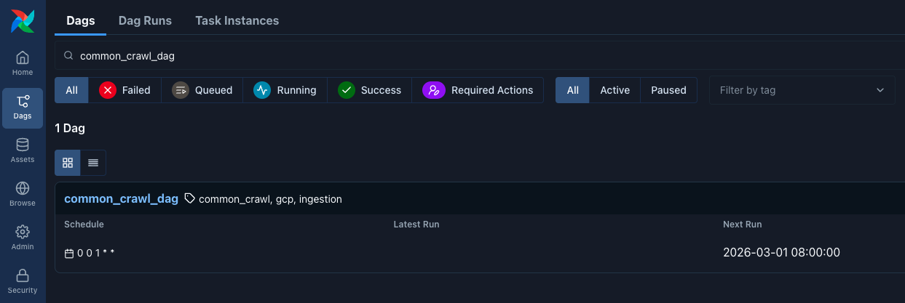

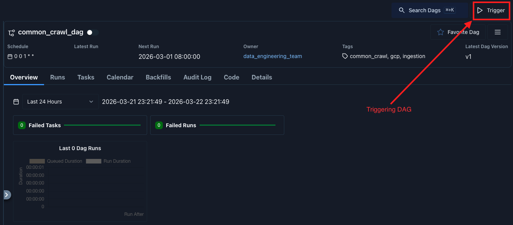

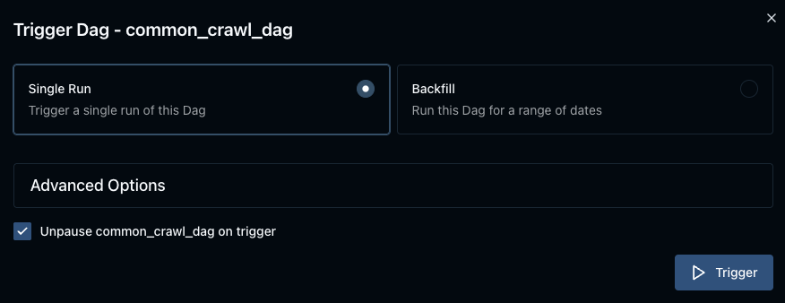

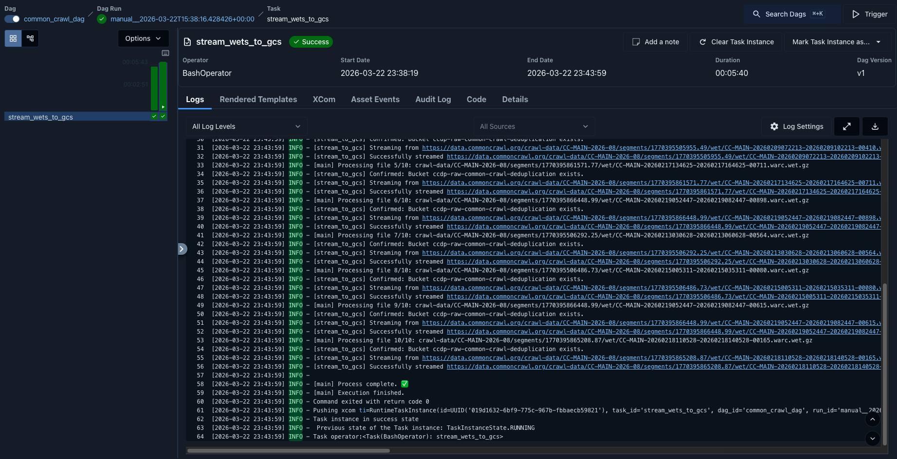

## Step 5: What the DAG Does

When `common_crawl_gcs_to_bigquery_dag` runs, it executes three tasks in order:

1. `ingest_to_gcs`
2. `transform_gcs_wets`
3. `load_final_docs_to_bigquery`

In plain English, that means:

1. It downloads a sampled set of Common Crawl WET files and uploads them into your GCS data lake.
2. It transforms those WET files into parquet outputs.
3. It loads the final parquet data into BigQuery.

So this DAG covers the full path from raw crawl text to a warehouse table you can query.

## What Success Looks Like

If everything works, you should end up with data in these locations:

- GCS raw files: `gs://ccdp-raw-common-crawl-deduplication/raw/<crawl_id>/...`
- GCS final parquet: `gs://ccdp-raw-common-crawl-deduplication/dedup_outputs/<crawl_id>/final_docs/...`
- GCS duplicate audit parquet: `gs://ccdp-raw-common-crawl-deduplication/dedup_outputs/<crawl_id>/duplicate_audit/...`
- BigQuery final table: `common-crawl-deduplication.common_crawl_dedup.final_docs`

You may also see sampled objects appear in the bucket like this:

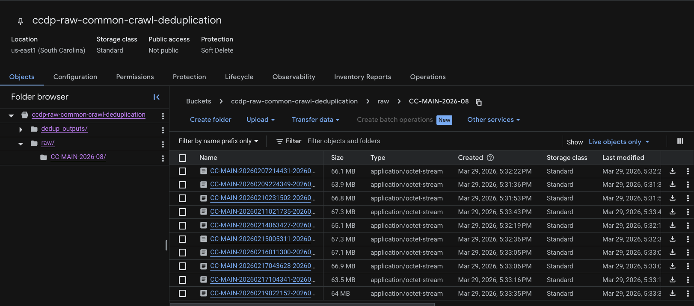

## Common Setup Issues

If the DAG is visible in Airflow but fails quickly, the most common reasons are:

- the service account JSON key is missing from `terraform/keys/`
- the JSON key filename does not match what the DAG expects
- the service account is missing `Storage Admin` or `BigQuery Admin`
- the GCS bucket was not created successfully by Terraform

If Airflow itself does not open at `http://localhost:8080`, it usually means the containers are still starting or the Docker build has not finished yet.

## Step 6: View the Dashboard Locally

After the pipeline completes and data is loaded into BigQuery, you can visualize the results using the local Streamlit dashboard.

The dashboard provides two main visualizations:

1. **Top Domains by Document Count** - Shows the categorical distribution of deduplicated documents across the most common domains
2. **Documents Over Time** - Shows the temporal distribution of documents by crawl date

### 6.1 Install Dashboard Dependencies

From the repository root, navigate to the dashboard directory and install the required packages:

```bash
cd dashboard
pip install -r requirements.txt
```

### 6.2 Run the Dashboard

Start the Streamlit dashboard:

```bash
streamlit run app.py
```

The dashboard will automatically open in your browser at `http://localhost:8501`.

This dashboard runs locally on your machine. For this project, that is enough to satisfy the dashboard requirement during a live demo or walkthrough.

### 6.3 Configure the Dashboard

The dashboard uses the same service account key as the pipeline. By default, it looks for:

```text
../terraform/keys/common-crawl-deduplication-184aa125ef30.json
```

You can adjust the configuration in the sidebar if needed:

- GCP Project ID
- BigQuery Dataset (default: `common_crawl_dedup`)
- BigQuery Table (default: `final_docs`)
- Service Account Key Path
- Number of top domains to display

### What the Dashboard Shows

The dashboard displays:

- **Summary Statistics**: Total documents, unique domains, crawl dates, and average text length
- **Top Domains Bar Chart**: Visual distribution of documents across the most common domains
- **Temporal Line Chart**: Document counts over time by crawl date
- **Data Tables**: Expandable views of the underlying data for each visualization

For more details, see [dashboard/README.md](../dashboard/README.md).

## Recommended Run Order

If you just want the cleanest path, use this order:

1. Create the GCP project.
2. Create the service account.
3. Grant `Storage Admin` and `BigQuery Admin`.
4. Download the JSON key.
5. Move the JSON key into `terraform/keys/`.
6. Confirm `terraform/variables.tf`.
7. Run `terraform apply`.
8. Run `docker compose up -d --build`.
9. Open `http://localhost:8080`.
10. Log in with `airflow` / `airflow`.
11. Trigger `common_crawl_gcs_to_bigquery_dag`.
12. Once the DAG completes, run the dashboard with `streamlit run app.py` from the `dashboard/` directory.

That is the full local setup for this project.
